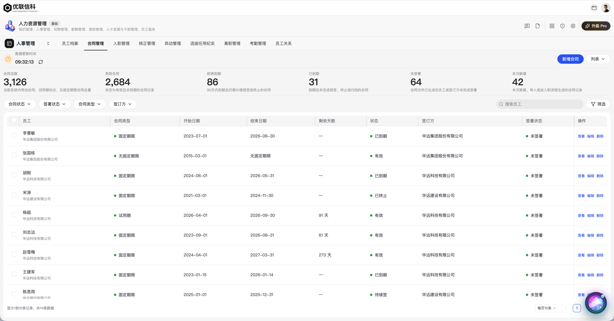
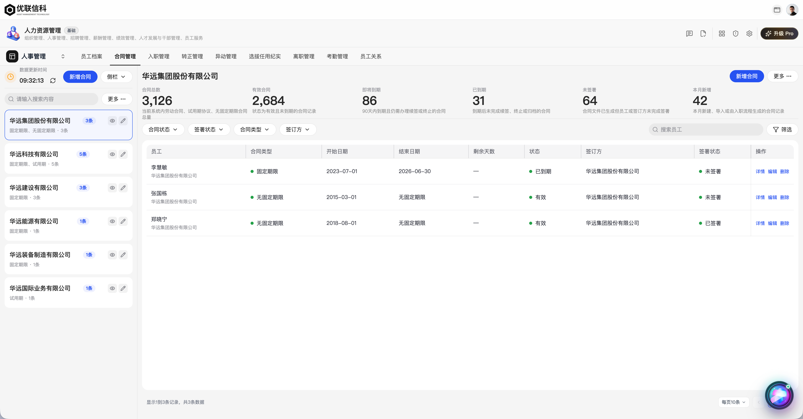
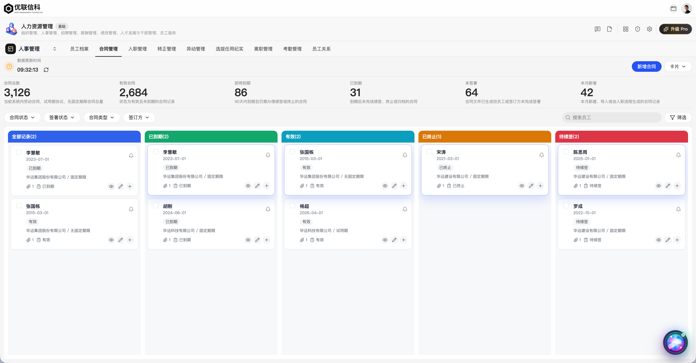
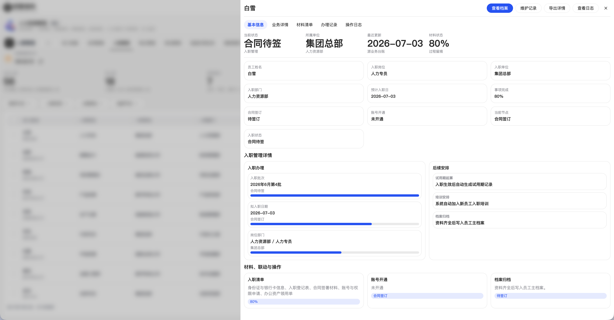
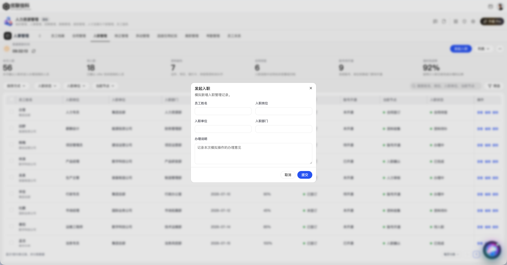
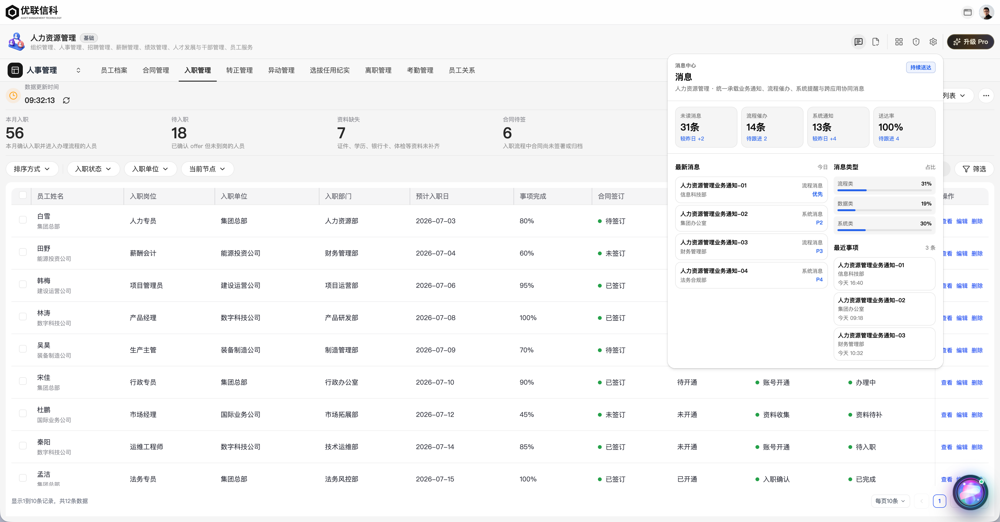
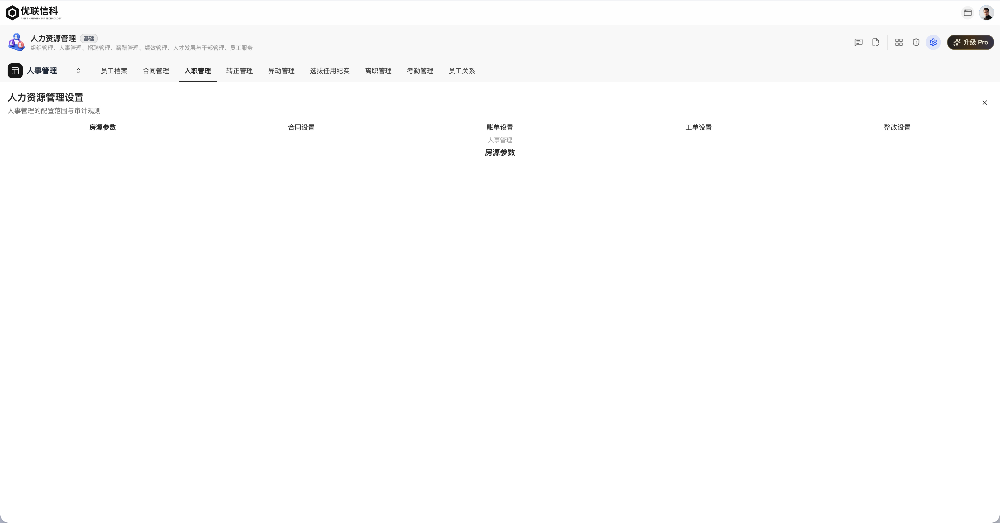
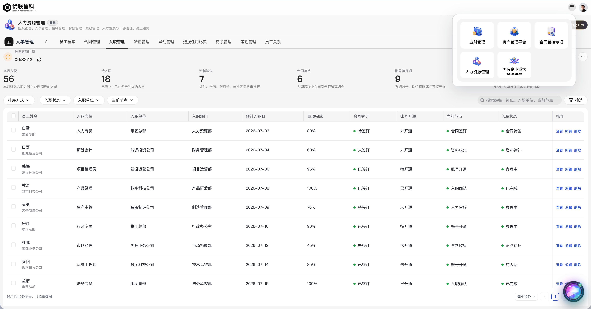
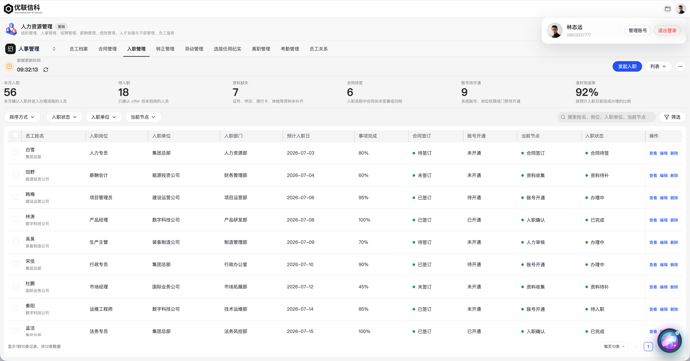
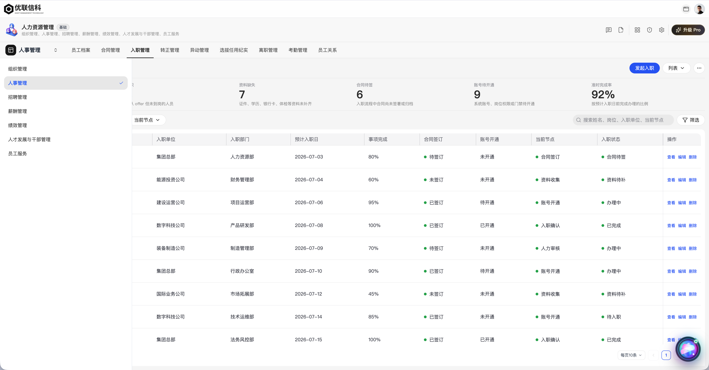

# Basic Shell Visual Reference

Use this reference for every generated or merged **Basic** business application. It is the source-faithful desktop visual baseline for the shared shell and common application states. Read [basic-shell-component-specification.md](basic-shell-component-specification.md) first for the portable written dimensions, colors, typography, resources, icon rules, and interactions. Keep business content source-faithful; do not copy the human-resources records, labels, metrics, names, or actions from these images.

## How To Use The Set

Open the base list screenshot for every Basic application. Then open only the image that matches the surface being implemented or reviewed. The images are reference-only: do not import them into the application. The reusable brand, avatar, and stock application-logo resources are listed separately in `basic-shell-component-specification.md`.

| State | Asset | Use it to verify |
| --- | --- | --- |
| Default record list | [basic-shell-list-table.png](../assets/screenshots/basic-shell-list-table.png) | Three-row shell, update/action row, metrics, filter toolbar, table, page controls. |
| Sidebar list | [basic-shell-sidebar-list.png](../assets/screenshots/basic-shell-sidebar-list.png) | Sidebar-mode ownership, selected group, compact sidebar actions, and content/table alignment. |
| Card board | [basic-shell-card-board.png](../assets/screenshots/basic-shell-card-board.png) | Status board columns, card density, controls, and shared shell continuity. |
| Detail drawer | [basic-shell-detail-drawer.png](../assets/screenshots/basic-shell-detail-drawer.png) | Full-viewport mask, right drawer, top actions, tabs, facts, and detail sections. |
| Form dialog | [basic-shell-form-dialog.png](../assets/screenshots/basic-shell-form-dialog.png) | Centered shared form dialog, field grid, footer actions, and background mask. |
| Global action panel | [basic-shell-global-action-panel.png](../assets/screenshots/basic-shell-global-action-panel.png) | App-scoped messages/todo/overview/risk popover, anchored to first-level actions. |
| Settings drawer | [basic-shell-settings-drawer.png](../assets/screenshots/basic-shell-settings-drawer.png) | Application settings as a shared drawer state, not a page-local header. |
| Application switcher | [basic-shell-application-switcher.png](../assets/screenshots/basic-shell-application-switcher.png) | Top-user-bar trigger, app-card grid, selected application, and route-changing switch. |
| Account popover | [basic-shell-account-popover.png](../assets/screenshots/basic-shell-account-popover.png) | Avatar-triggered account panel, identity, management action, and logout action. |
| Module switcher | [basic-shell-module-switcher.png](../assets/screenshots/basic-shell-module-switcher.png) | Fixed left module panel, selected module state, and dimmed content behind it. |

## Gallery





















## Required Shared Composition

### Standalone implementation

When the target does not provide the current platform shell, implement the composition named in `basic-shell-component-specification.md` locally. It must use only the written sizes/tokens/behaviors and the bundled resources under `assets/basic-shell/`; do not import any of the paths in the next section. The completed standalone shell must still expose all three navigation rows and matching overlay states.

### Existing-platform implementation

Mount navigation once in `apps/web/src/App.jsx`:

```jsx
<TopNavigation
  route={route}
  activeNavKey={activeNavKey}
  platformMode={platformPageMode}
  applicationShellActive={Boolean(applicationShellApp)}
  applications={applications}
  userSession={authSession}
  proTier={proTier}
  onRoute={navigateFromTopNavigation}
  onLogout={handleLogout}
/>
```

`TopNavigation` owns the visible shell and shared overlays:

| Surface | Shared owner | Feature responsibility |
| --- | --- | --- |
| Top user bar, application switcher, account popover | `TopNavigationPrimaryBar` | None. Do not render brand, switching, or account chrome in a page. |
| First-level application identity/actions, global action panel | `TopNavigationSecondaryNav` and application-global-actions feature | Supply navigation metadata and app-wide action data through the model. |
| Second-level module/tab navigation and module switcher | `TopNavigationSecondaryNav` / `useWorkspaceSelection` | Supply route-backed module groups and tabs through the model. |
| Settings state | `ApplicationSettingsDrawer` initiated by `TopNavigation` | Supply app settings metadata; do not build a separate settings page header. |
| Detail/form state | `ApplicationDetailDrawer` / `ApplicationFormDialog` | Supply source fields, data, and actions through shared primitives. |

Do not import `TopNavigationPrimaryBar` or `TopNavigationSecondaryNav` into a business feature. A feature starts below the composed shell and owns page content, source fields, record interaction, and local business state only.

## Registration Before Page UI

Before writing the generated page component, wire the selected application into the shared shell:

1. Add catalog data in `apps/web/src/data/applications/applicationGroups.js`: `name`, `icon` or `logoSrc`, `summary`, `viewKey`/`href`, and `color`.
2. Add navigation data in `apps/web/src/widgets/navigation/model/topNavigationModel.js`: stable `id`, application `routeKey`, `moduleGroups` (preferred) or legacy module data, default child module, routes, and optional settings module.
3. Register the application route/view so `applicationShellApp` resolves in `App.jsx`; its truthy value enables `TopNavigationSecondaryNav` through `applicationShellActive`.
4. Give every new Basic app at least one module and one active tab. A one-module app uses the shared static module anchor, not a title-only page.
5. Leave `TopNavigation`, `TopNavigationPrimaryBar`, `TopNavigationSecondaryNav`, `useWorkspaceSelection`, and `02-navigation.css` as shared owners. Add business-specific styles only in the feature/page owner.

## Desktop Geometry

Use `apps/web/styles/00-base.css` and `apps/web/styles/02-navigation.css` as the implementation truth. The screenshot bitmap is high-density and must not be used to infer raw CSS values.

| Shell region | CSS owner | Required geometry |
| --- | --- | --- |
| Top user bar | `.topbar` | `--topbar-height: 52px`; company lockup left; application switcher and avatar right. |
| First-level application navigation | `.secondary-app-bar` | `--application-title-nav-height: 72px`; 12px horizontal padding; 48px app logo/icon; title, tier badge, summary; compact right action cluster. |
| Second-level module/tab navigation | `.secondary-module-row` | `--application-subnav-height: 48px`; 12px horizontal padding; module anchor/switcher left; shared tabs right. |
| Complete Basic shell | `.top-navigation.has-secondary-nav` | 172px total: `52px + 72px + 48px`; uninterrupted dividers, no floating shell cards. |

## Visual Acceptance

Before handing off a Basic application, open one desktop route at the controlled `1920 x 1080` CSS viewport and capture a screenshot. The bundled images remain structural/state references unless their viewport, DPR, route, fixture, browser, font, and theme metadata match the controlled run; do not treat bitmap dimensions alone as a pixel-diff baseline. Mobile verification is outside this specification version.

1. Always compare the normal list/table route to `basic-shell-list-table.png`: shell stack, content offset, update/action row, metrics, filters, table, and pagination density.
2. Compare sidebar or card board only when the page exposes that view mode. Do not invent either view solely to satisfy a screenshot.
3. Compare detail drawer, form dialog, global action panel, settings drawer, application switcher, account popover, and module switcher whenever the implemented source flow opens that surface.
4. Confirm the company lockup appears once; the first-level identity/actions and second-level module/tabs remain shared and route-driven; no page-local duplicate exists.
5. Confirm a one-module/one-page application still renders a static module anchor and active tab.
6. Confirm the feature does not override `.topbar`, `.secondary-app-bar`, `.secondary-module-row`, `.secondary-tabs`, or shared overlay styles.

Do not declare a screen source-faithful solely because its content renders. Structural reuse plus comparison to every implemented reference state are both required.
